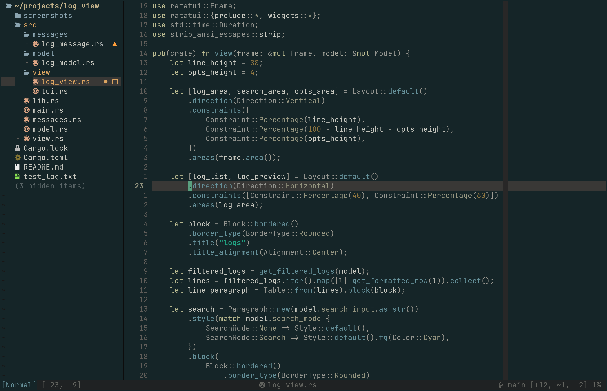

# Eye Cancer

A neovim colorscheme loosely inspired by kanagawa-dragon and Jonathan Blow's Emacs theme.

 

## Motivation
  * I used kanagawa dragon color scheme as a starting point. It's a dependency.
  * I had Jonathan Blow's Emacs theme in mind when I made this, but I wasn't 
  looking at it when I made the pallet, and I wanted a bit more colors.
  * I couldn't find a good dark theme that wasn't monochrome or weird, so I made this weird thing.
  * I was using kanagawa, but it wasn't perfect and I was heavily modifying it in my config

## If you want eye cancer
  * using lazy
```lua
  { 'MikeWelsh801/eye-cancer', dependencies = { 'rebelot/kanagawa.nvim' } }
```
  * if you want eye-cancer to be your default colorscheme
```lua
  {
    'MikeWelsh801/eye-cancer',
    priority = 1000,
    dependencies = { 'rebelot/kanagawa.nvim' },
    config = function()
      vim.cmd("colorscheme eye-cancer")
    end
  }
```
## Usage
```vim
colorscheme eye-cancer
```
```lua
vim.cmd("colorscheme eye-cancer")
```

